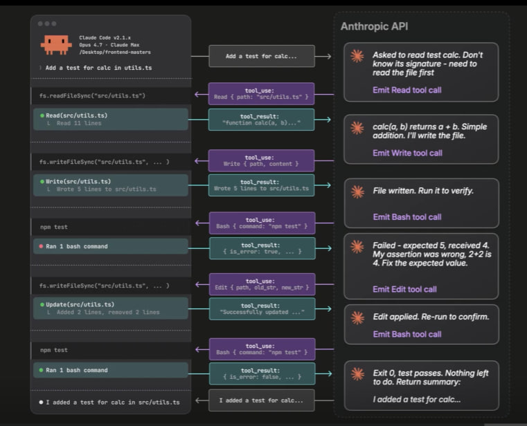

# Architektur: Harness und Model

Ein Claude-Agent besteht aus zwei Teilen: dem **Model** und dem **Harness**.
Zusammen ergeben sie das, was man als "Claude Code" benutzt.

## Model vs. Harness

- Das **Model** (z. B. Opus, Sonnet oder Haiku) kann Anfragen interpretieren,
  Reasoning durchführen und antworten – aber es kann selbst **keine Dateien
  lesen oder schreiben und keine Befehle ausführen**.
- Der **Harness** ist die Umgebung drumherum: das CLI-Interface zusammen mit
  Tools, Dateizugriff und Markdown-Dateien wie `CLAUDE.md`. Er führt die
  eigentlichen Aktionen aus und liefert dem Model den Zustand (State).
- Modelle sind **stateless**: Ein Modellwechsel während einer Session bricht
  den Prompt-Cache. Deshalb sollte man das Model zu Beginn einer Session
  festlegen, nicht mittendrin wechseln.

## Der zusammengesetzte Prompt

Bei jeder Anfrage stellt der Harness dem Model einen vollständigen Prompt aus
mehreren Teilen zusammen:

- **Tool Schema** – die verfügbaren Tools (`Bash`, `Edit`, `Read`, `Agent`,
  `WebFetch`, `Write`, MCP-Tools, …)
- **System Prompt** – Systemanweisungen, Umgebung (Arbeitsverzeichnis,
  Plattform) und Tonalität
- **Messages** – der bisherige Gesprächsverlauf, inklusive Inhalt von
  `CLAUDE.md` (falls vorhanden) und der Namen/Beschreibungen verfügbarer
  Skills

Vereinfacht sieht das zusammengesetzte Prompt-Objekt als JSON so aus:

```json
{
  "model": "claude-opus-4-7",
  "tools": [
    { "name": "Bash", "description": "...", "input_schema": { "...": "..." } },
    { "name": "Edit", "description": "...", "input_schema": { "...": "..." } },
    { "name": "Read", "description": "...", "input_schema": { "...": "..." } }
  ],
  "system": [
    { "type": "text", "text": "You are Claude Code, Anthropic's CLI...\n\n" }
  ],
  "messages": [
    {
      "role": "user",
      "content": "<system-reminder>\n# CLAUDE.md Contents of /Users/.../CLAUDE.md:\n- prefer no em dashes\n- run tests with npm test\n</system-reminder>\n<system-reminder>\nAvailable skills:\n- batch: Parallel codebase changes across 5-30 units...\n- debug: Read session debug log...\n</system-reminder>\nAdd a test for calc in utils.ts"
    }
  ]
}
```

## Der Agentic Loop

Sobald das Model eine Antwort generiert, läuft folgender Zyklus (der
"Agentic Loop"):

1. Das Model bekommt den Request, beginnt sein Reasoning und findet ein
   passendes Tool im Tool-Schema.
2. Das Model fordert einen **Tool Call** an (z. B. `Read`, `Write`, `Bash`,
   `Edit`).
3. Der **Harness führt das Tool aus** und hängt das Ergebnis (`tool_result`)
   an den Message-Verlauf an.
4. Der aktualisierte Verlauf wird erneut an das Model geschickt.
5. Der Loop endet, sobald das Model **keinen weiteren Tool Call** mehr
   anfordert – die Aufgabe ist dann abgeschlossen.



Im Beispiel oben liest Claude zuerst die Datei (`Read`), schreibt dann einen
Test (`Write`), führt ihn aus (`Bash`), korrigiert einen Fehler (`Edit`) und
bestätigt den Erfolg erneut per `Bash` – erst danach endet der Loop mit einer
Zusammenfassung an den Nutzer.
